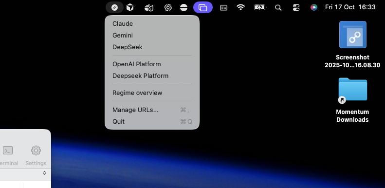
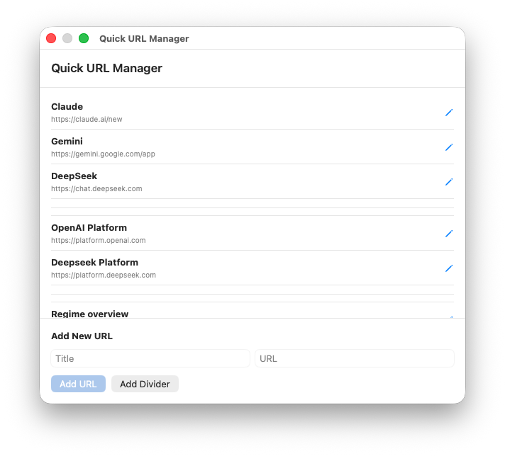

# 🔗 QuickURL

> Your favorite URLs, one click away.

A lightweight macOS menu bar app that gives you instant access to your most-visited URLs. No more fumbling through bookmarks or typing the same addresses over and over—just click and go.


## ✨ Features

- **🚀 Lightning Fast** - Access your URLs from the menu bar in a single click
- **📝 Easy Management** - Add, edit, reorder, and delete URLs with a clean interface
- **🎯 Organized** - Add dividers to group related URLs
- **💾 Persistent** - Your URLs are saved and ready when you need them
- **🎨 Native** - Built with SwiftUI for a truly native macOS experience
- **⚡️ Lightweight** - Sits quietly in your menu bar using minimal resources

## 📸 Screenshots





### Menu Bar Access
Click the link icon in your menu bar to instantly see all your saved URLs.

### URL Manager
A clean, intuitive interface for managing your URL collection—drag to reorder, click to edit.

## 🎯 Use Cases

- **Developers**: Quick access to GitHub repos, documentation, local dev servers
- **Content Creators**: Jump to analytics, social media dashboards, and publishing tools
- **Researchers**: Organize frequently referenced papers, databases, and resources
- **Anyone**: Your daily go-to websites, just a click away

## 🛠 Installation

### Building from Source

1. **Clone the repository**
   ```bash
   git clone https://github.com/yourusername/QuickURL.git
   cd QuickURL
   ```

2. **Open in Xcode**
   ```bash
   open QuickUrl/QuickUrl.xcodeproj
   ```

3. **Build and Run**
   - Select your target Mac
   - Click Run (⌘R)
   - Grant necessary permissions when prompted

### Requirements

- macOS 13.0 or later
- Xcode 15.0 or later
- Swift 5.9 or later

## 🎮 How to Use

1. **First Launch**: QuickURL appears in your menu bar with a link icon
2. **Access URLs**: Click the menu bar icon and select any URL to open it in your default browser
3. **Manage URLs**: Select "Manage URLs..." (⌘,) to open the manager window
4. **Add URLs**: Enter a title and URL, then click "Add URL"
5. **Add Dividers**: Organize your URLs with visual separators
6. **Edit**: Click the pencil icon next to any URL to modify it
7. **Reorder**: Drag URLs up and down to arrange them
8. **Delete**: Swipe left or use the delete key to remove URLs

## 🏗 Architecture

QuickURL is built following clean MVVM architecture with strict separation of concerns:

```
📁 QuickUrl/
├── 📱 Views/          # SwiftUI views (display only)
├── 🎭 ViewModels/     # Data formatting & view logic
├── 🧩 Models/         # Business logic & data structures
└── ⚙️ Services/       # External integrations (storage, etc.)
```

### Key Components

- **URLItem**: Model representing a URL or divider
- **URLStorageService**: Handles persistence with UserDefaults
- **URLManagerViewModel**: Manages URL collection state
- **URLManagerView**: Interface for URL management
- **AppDelegate**: Menu bar integration and menu generation

## 🤝 Contributing

Contributions are welcome! Whether it's bug fixes, feature additions, or documentation improvements:

1. Fork the repository
2. Create your feature branch (`git checkout -b feature/AmazingFeature`)
3. Commit your changes (`git commit -m 'Add some AmazingFeature'`)
4. Push to the branch (`git push origin feature/AmazingFeature`)
5. Open a Pull Request

### Ideas for Contributions

- [ ] Import/export URL collections
- [ ] Custom icons for URLs
- [ ] URL categories with submenus
- [ ] Keyboard shortcuts for frequently used URLs
- [ ] URL validation and health checking
- [ ] iCloud sync between Macs
- [ ] Dark mode optimizations
- [ ] Custom color schemes

## 📝 License

This project is licensed under the MIT License - see the [LICENSE](LICENSE) file for details.

## 💡 Inspiration

Born from the simple need to access development tools and frequently-visited websites faster. Why dig through browser bookmarks when a single menu bar click can get you there?

## 🙏 Acknowledgments

- Built with love using SwiftUI
- Icon: SF Symbols `link.circle.fill`

## 📬 Contact

Got questions, suggestions, or just want to say hi? Open an issue or reach out!

---

**Made with ❤️ for productivity enthusiasts**

*If you find QuickURL useful, give it a ⭐️ and share it with your friends!*
